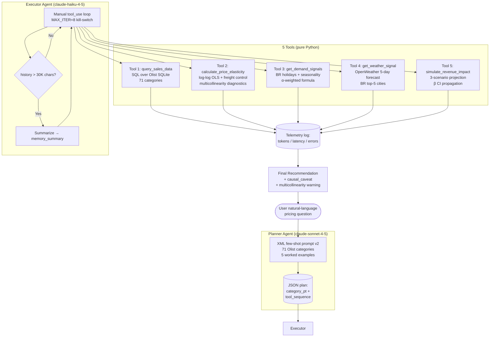
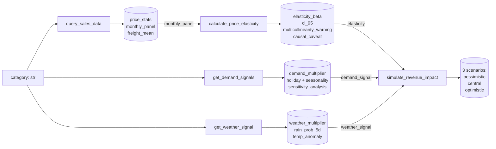
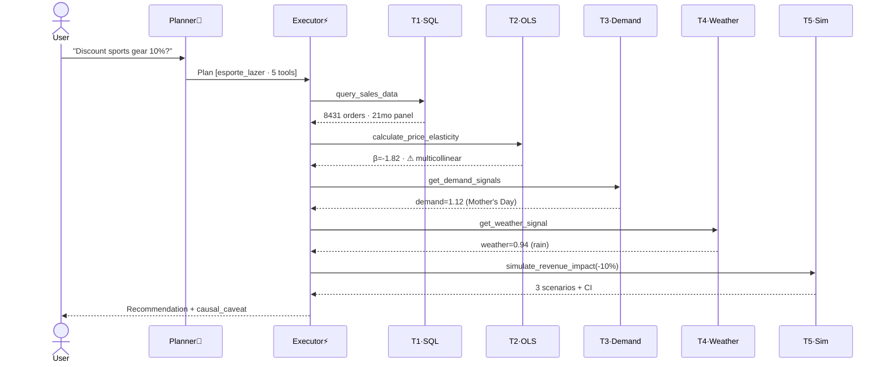
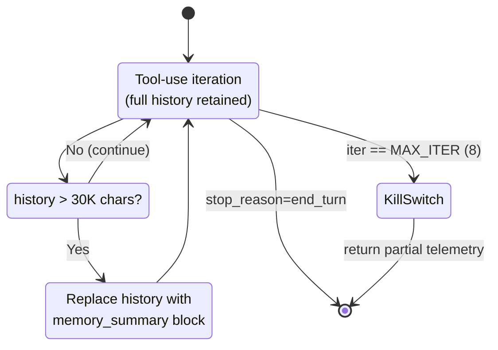

# PriceIQ Architecture

> Mermaid diagrams that match the actual code in `priceiq_*.py`.

## Top-level pipeline

## Tool I/O contracts

## Sequence: a complete agent run

## State strategy

## Module dependency

See `README.md` § Files for the dependency tree (textual form).
Removed mermaid diagram to avoid duplication — the README ASCII version is
authoritative and updates more naturally with code changes.
